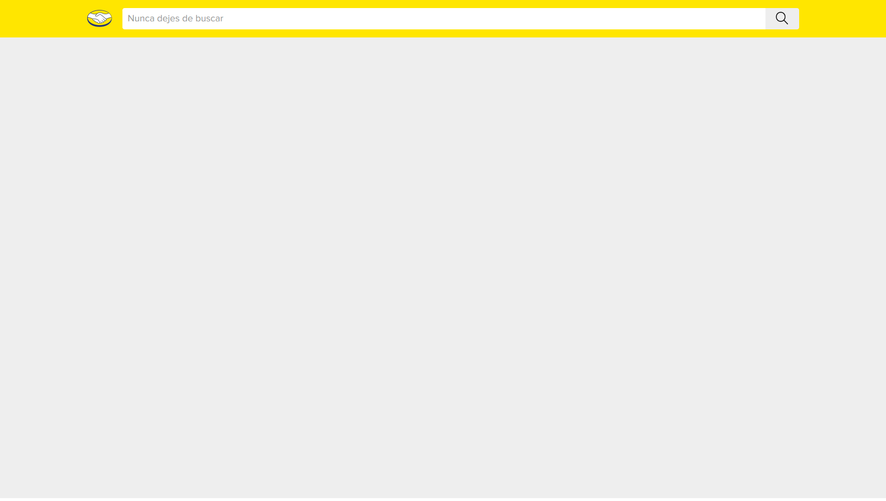
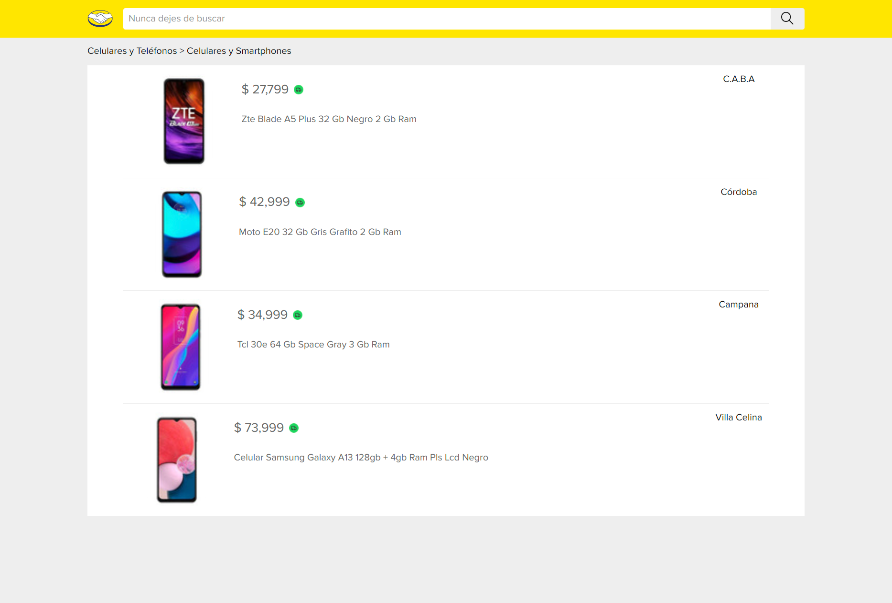
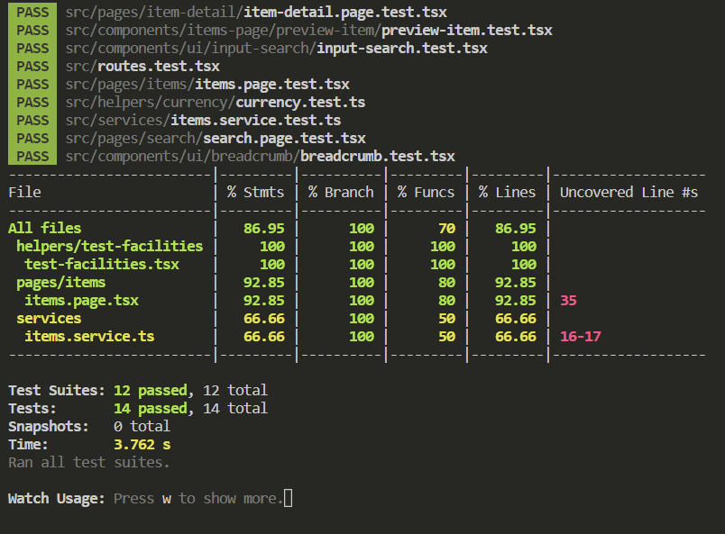
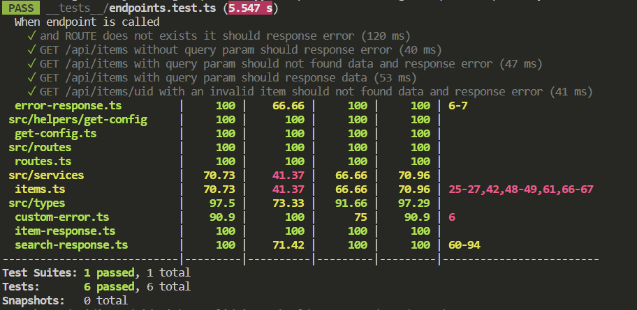

# 2023 MELI test

This is a challenge's resolution.

Contains two projects: client and server coded using React and Nodejs along with typescript.

Client side files are defined as the principal folder structure and server files are inside `server/` dir.

## Actual State

### search

### items

### items/:id

### Client coverage

### Server coverage

## Requirements

You will need: 
- [Node.js](https://nodejs.org/es/) `v16.16.0`

## Install

### `npm install:all`

Install client and server projects.

### `npm install`

Install client dependencies

### `npm install:server`

Install server dependencies

## Start

### `npm run start`

Runs the app in the development mode.\
Open [http://localhost:3000](http://localhost:3000) to view it in the browser.

At the same time, runs server side on [http://localhost:5000](http://localhost:5000)

The page will reload if you make edits.
You will also see any lint errors in the console.

### `npm run start:server`

Runs server side on [http://localhost:5000](http://localhost:5000)

### `npm run start:client`

Runs the app in the development mode.\
Open [http://localhost:3000](http://localhost:3000) to view it in the browser.

## Build

### `npm run build`

Builds client and server for production to the `dist` folder.

### `npm run build:server`

Build server side

### `npm run build:client`

Build client side

## Test

Libraries used to test:

- [Jest](https://jestjs.io/)
- [React testing library](https://testing-library.com/)

### `npm run test`

Start tests on client and server

### `npm run test:server`

Start tests on server side

### `npm run test:client`

Start tests on client side

### Coverage

### `npm run coverage`

Start test coverage on client and server

### `npm run coverage:server`

Start test coverage on server side

### `npm run coverage:client`

Start test coverage on client side
